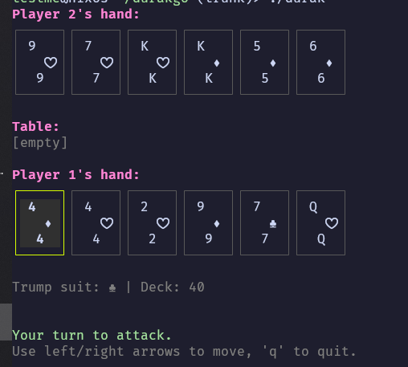

# Durak 
- Durak game vs AI with mcts decision making. 
- Libraries used: BubbleTea, Lipgloss.
- Thanks to the gg repo `https://github.com/Kaamkiya/gg/tree/main` for the mcts based off their tictactoe. 
```shell
go build .
./durak
```
## Screenshots

